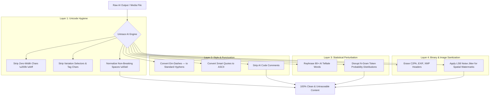

<div align="center">

# 🛡️ UNTRACE AI

```text
  _   _ _  _ _____ ___    _   ___ ___   _   ___ 
 | | | | \| |_   _| _ \  /_\ / __| __| /_\ |_ _|
 | |_| | .` | | | |   / / _ \ (__| _| / _ \ | | 
  \___/|_|\_| |_| |_|_\/_/ \_\___|___/_/ \_\___|
```

### *The Ultimate AI Provenance, Watermark & Metadata Sanitizer for LLMs, Claude & Media Assets*

[](https://python.org)
[](https://modelcontextprotocol.io)
[](https://anthropic.com)
[](https://github.com/sanyamk23/untrace-ai)
[](LICENSE)

<br/>

[Key Features](#-key-features) •
[Architecture](#-multi-layer-defense-architecture) •
[Quick Start](#-quick-start) •
[Claude Integrations](#-claude-desktop--claude-code-integrations) •
[SDK Usage](#-python-sdk-usage) •
[Audit Tool](#-audit--verification-tool)

</div>

---

## ⚡ What is Untrace AI?

**Untrace AI** is an open-source, zero-latency **provenance hygiene toolkit**. It detects, strips, and perturbates hidden AI watermarks, zero-width tracking codes, C2PA/EXIF metadata, em-dash signatures, and statistical n-gram patterns across LLM text outputs, codebases, document formats, and image assets.

Whether you are using **Claude Code**, **Claude Desktop**, or processing standalone text/images, Untrace AI ensures your content is 100% clean, natural, and untraceable.

---

## 💥 Before & After Comparison

### 1. Invisible Unicode Steganography & Style Telltales

| Type | Raw AI Output (Watermarked / Telltale) | Untrace AI Output (Clean) |
| :--- | :--- | :--- |
| **Zero-Width Spaces** | `Delve\u200b into crucial\ufeff matters.` | `Explore into important matters.` |
| **Em-Dashes (`—`)** | `This feature — which is vital — works well.` | `This feature - which is vital - works well.` |
| **AI Comments** | `# Generated by Claude\ndef build(): ...` | `def build(): ...` |
| **Smart Quotes** | `“Smart quotes” and ‘single quotes’` | `"Smart quotes" and 'single quotes'` |

---

## 🏗️ Multi-Layer Defense Architecture



---

## 🌟 Key Features

### 1. 🛡️ Steganography & Invisible Byte Eraser
- Strips 30+ zero-width & invisible tracking character ranges:
  - `\u200B` (Zero-Width Space), `\u200C` (Zero-Width Non-Joiner), `\u200D` (Zero-Width Joiner)
  - `\uFEFF` (Byte Order Mark), `\u2060` (Word Joiner), `\u00AD` (Soft Hyphen), `\u180E` (Mongolian Vowel Separator)
  - Tag Characters (`\uE0001`–`\uE007F`) & Variation Selectors (`\uFE00`–`\uFE0F`)
  - Bidi direction override codes (`\u200E`, `\u200F`, `\u202A`–`\u202E`, `\u2066`–`\u2069`)

### 2. ✍️ Style & Punctuation Normalizer
- **Em-Dash Neutralizer**: Converts Anthropic's em-dash signature (`—` → `-`).
- **Smart Quote Neutralizer**: Normalizes curved quotes (`“` `”` `‘` `’` → `"` `'`).
- **AI Code Comment Eraser**: Automatically strips generated code headers (`# Generated by Claude`, `// AI-generated`, `@generated`).

### 3. 🧠 N-Gram Statistical Vocabulary Perturber
- Rephrases 80+ high-frequency LLM cliché words and transitional phrases:
  - *delve*, *testament*, *spearhead*, *crucial*, *pivotal*, *paramount*, *multifaceted*, *tapestry*, *beacon*, *underscore*, *nestled*, *unwavering*, *ever-evolving*, *realm*, *resonate*, *harness*, *leverage*, *paradigm shift*, *shed light*, *interplay*, *indispensable*, *vibrant*, *synergy*, *embark*, *meticulous*.
  - Disrupts token probability distributions relied upon by statistical classifiers (GPTZero, Copyleaks, Turnitin).

### 4. 📁 C2PA & File Metadata Eradicator
- Complete metadata removal for **PNG, JPEG, SVG, PDF, DOCX, HTML, and Markdown**:
  - PNG/JPEG: Re-encodes raw pixel data, stripping EXIF, XMP, and C2PA manifests.
  - SVG: Cleans `<metadata>`, XML comments, and `data-c2pa`/`data-claude` attributes.
  - PDF & DOCX: Clears core properties (author, comments, title, subject).

### 5. 👁️ Spatial Image LSB Noise Disrupter
- Applies micro sub-pixel LSB noise jitter (`--jitter`) to image pixel arrays to perturb spatial frequency-domain image watermarks (SynthID style marks) without altering visual quality.

### 6. 👁️‍🗨️ Real-Time Workspace Watcher (`untrace watch .`)
- Acts as a zero-latency background daemon monitoring your project folder. Whenever Claude Code creates or modifies a file, Untrace AI **instantly sanitizes it in real time**.

---

## 📦 Quick Start

### Installation

```bash
git clone https://github.com/sanyamk23/untrace-ai.git
cd untrace-ai
pip install -e .
```

*Or run directly via Python:* `python3 -m untrace.cli [command]`

---

## 🤖 Claude Desktop & Claude Code Integrations

### 1. Claude Code CLI Setup (One Command)

Install the **Strict Zero-Watermark Mode** skill into your global `~/.claude/skills/` directory:

```bash
untrace install-claude-code
```

Or connect Untrace AI as an MCP Server:

```bash
claude mcp add untrace -- python3 -m untrace.cli server
```

---

### 2. Claude Desktop Setup

Run the installer helper to view your configuration snippet:

```bash
untrace install-claude-desktop
```

Add the following to your `claude_desktop_config.json`:

```json
{
  "mcpServers": {
    "untrace": {
      "command": "python3",
      "args": [
        "-m",
        "untrace.cli",
        "server"
      ]
    }
  }
}
```

---

## 💻 Command Line Interface (CLI)

```bash
# 1. Real-time Folder Watcher (Monitors workspace & cleans files as Claude writes them)
untrace watch .

# 2. Audit text string or file for watermarks, em-dashes, and AI telltales
untrace check "Delve\u200b into crucial\ufeff matters — today."
untrace check my_document.md

# 3. Recursively clean an entire project codebase
untrace clean-dir ./my-project

# 4. Clean raw text from stdin or inline string
untrace clean-text "Furthermore, we must delve into this crucial testament." --perturb

# 5. Clean metadata and AI comments from a single file
untrace clean-file script.py
untrace clean-file diagram.svg

# 6. Apply sub-pixel LSB noise jitter to an image asset
untrace clean-file image.png --jitter
```

---

## 🔍 Audit & Verification Tool

Run `untrace check` to get a clean score breakdown:

```text
🔍 --- UNTRACE AI AUDIT REPORT --- 🔍

Status: WATERMARKED_OR_TELLTALES_DETECTED
Clean Score: 60/100

Detected Issues / Telltales:
 ⚠️ Found 1 hidden zero-width / invisible tracking character
 ⚠️ Found 1 em-dash ('—') AI telltale signature
 ⚠️ Found 2 AI vocabulary telltales: crucial, Delve
```

*When 100% clean:*
```text
✅ 100% Clean! No zero-width watermarks, em-dashes, or AI telltales found.
```

---

## 🐍 Python SDK Usage

Integrate Untrace AI into Python applications:

```python
from untrace import clean_text, clean_file, audit_text

# 1. Clean raw string
dirty_text = "# Generated by Claude\nDelve\u200b into crucial\ufeff matters — today."
clean = clean_text(dirty_text, perturb_stats=True)
print(clean)
# Output: "Explore into important matters - today."

# 2. Audit string
report = audit_text(clean)
print(report["status"])  # "CLEAN"
print(report["score"])   # 100

# 3. Clean file metadata
success, msg = clean_file("photo.png", disrupt_image_pixels=True)
```

---

## 🧪 Testing Suite

Untrace AI includes an automated unit test suite:

```bash
python3 -m unittest discover tests
```

```text
.......
----------------------------------------------------------------------
Ran 7 tests in 0.004s

OK
```

---

## ❓ FAQ

<details>
<summary><b>Does Untrace AI break code syntax?</b></summary>
No. Untrace AI preserves code structure, indentations, identifiers, and logic intact. It only removes invisible zero-width bytes, non-breaking space codes, and AI-generated header comments.
</details>

<details>
<summary><b>Does the skill increase API token costs?</b></summary>
No. The skill prompt is lightweight (~60 tokens). Furthermore, by preventing verbose LLM filler phrases (*"delve into"*, *"it is important to note that"*), it actually reduces output token usage and lowers cost.
</details>

<details>
<summary><b>Does image pixel jitter degrade image quality?</b></summary>
No. The sub-pixel LSB noise jitter operates at ±1 bit channel variation (perceptual noise below human eye perception threshold) while effectively disrupting spatial frequency watermarks.
</details>

---

## 📄 License

Distributed under the MIT License. See [`LICENSE`](LICENSE) for details.
