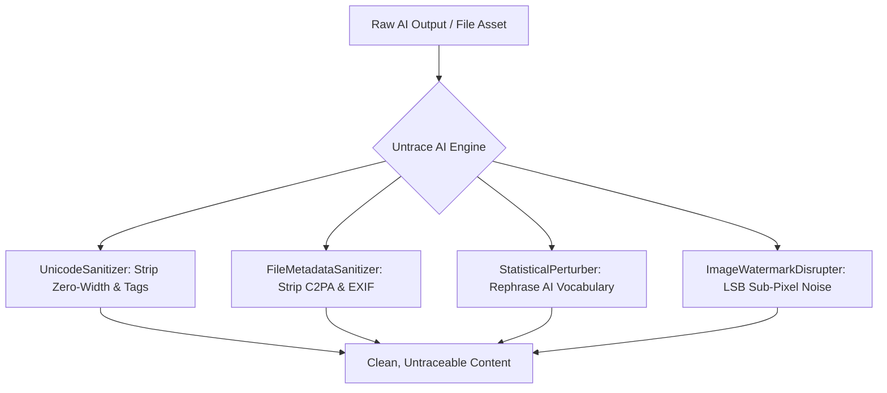

<div align="center">

# 🛡️ Untrace AI

### *Ultimate AI Provenance, Watermark & Metadata Sanitizer for LLMs, Claude, and Media Files*

[](https://python.org)
[](https://modelcontextprotocol.io)
[](https://anthropic.com)
[](LICENSE)

---

**Untrace AI** is an open-source, enterprise-grade **provenance hygiene toolkit**. It detects, strips, and perturbates hidden AI watermarks, zero-width tracking codes, C2PA/EXIF metadata, and statistical n-gram signatures across LLM text outputs, document formats, and image assets.

</div>

---

## ⚡ Core Protections & Features

| Category | Protection Mechanism | Description |
| :--- | :--- | :--- |
| **Unicode Hygiene** | Zero-Width & Tag Stripping | Eliminates `\u200B`, `\u200C`, `\u200D`, `\uFEFF`, `\u2060`, `\u00AD`, variation selectors (`\uFE00`–`\uFE0F`), tag characters (`\uE0001`–`\uE007F`), and direction overrides. |
| **Space Normalization** | Canonical Formatting | Converts non-breaking spaces (`\u00A0`), thin spaces (`\u2009`), and figure spaces into standard ASCII spaces (`\u0020`). |
| **Homoglyph Defense** | NFKC Normalization | Converts Cyrillic/Greek lookalike homoglyphs back to standard canonical Latin characters. |
| **Statistical Defense** | Vocabulary Perturbation | Rephrases 50+ telltale AI transition phrases (*delve*, *testament*, *spearhead*, *crucial*, *pivotal*, *tapestry*, *seamlessly*, etc.) to disrupt n-gram AI classifier models. |
| **Metadata Stripping** | C2PA / EXIF / XMP Cleaning | Strips embedded provenance manifests, EXIF tags, XMP blocks, and structural comments from **PNG, JPEG, SVG, PDF, DOCX, HTML, and Markdown**. |
| **Spatial Image Jitter** | LSB Noise Perturbation | Optional micro sub-pixel LSB noise jitter to disrupt spatial frequency-domain image watermarks (SynthID style marks). |

---

## 🏗️ Architecture & Integrations



---

## 📦 Quick Start

### 1. Installation

```bash
git clone https://github.com/sanyamk23/untrace-ai.git
cd untrace-ai
pip install -e .
```

---

### 2. Integration with Claude Code CLI

Automatically install the Untrace AI skill into your global `~/.claude/skills/` directory:

```bash
untrace install-claude-code
```

Or connect the MCP server directly to your Claude Code instance:

```bash
claude mcp add untrace -- python3 -m untrace.cli server
```

---

### 3. Integration with Claude Desktop

Run the installer command to view your configuration snippet:

```bash
untrace install-claude-desktop
```

Add the generated config to your `claude_desktop_config.json`:

```json
{
  "mcpServers": {
    "untrace": {
      "command": "python3",
      "args": [
        "-m",
        "untrace.cli",
        "server"
      ]
    }
  }
}
```

---

## 💻 Command Line Interface (CLI)

```bash
# Clean raw text from invisible zero-width watermarks
untrace clean-text "Delve\u200b into crucial\ufeff matters."

# Clean text with statistical AI vocabulary rephrasing
untrace clean-text "Furthermore, we must delve into this crucial testament." --perturb

# Clean document or image file metadata (PDF, DOCX, SVG, PNG, JPEG, HTML, MD)
untrace clean-file document.pdf
untrace clean-file vector_art.svg

# Apply LSB pixel noise jitter to an image to disrupt spatial watermarks
untrace clean-file photo.png --jitter
```

---

## 🧪 Testing Suite

Untrace AI comes with a 100% automated test suite:

```bash
python3 -m unittest discover tests
```

---

## 📄 License

Distributed under the MIT License. See `LICENSE` for details.
